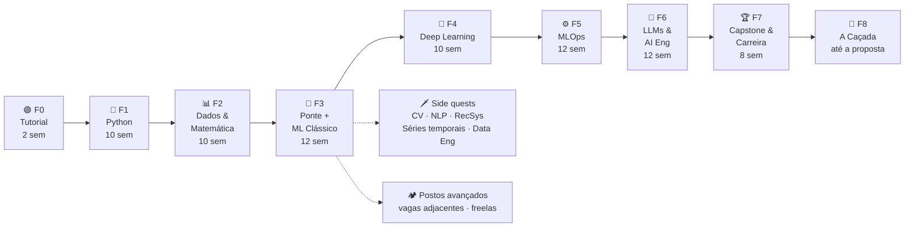

<p align="center"></p>

# 🗺️ Roadmap — Do Zero a AI Engineer

🇧🇷 **Português** · [🇺🇸 English](./ROADMAP.en.md)

> ⛓️ Este roadmap é jogado como um RPG narrativo: veja a [saga](./saga/). Use `/mestre` para relatar missões; todos os comandos estão em [COMANDOS.md](./COMANDOS.md).

> Um jogo de ~18 meses (≈76 semanas, 8–10 h/semana) para sair do zero em programação até a primeira vaga como **ML / MLOps / AI Engineer**.
> Regras completas em [Como o jogo funciona](#regras). Vocabulário em [`CONTEXT.md`](./CONTEXT.md).

> **Índice:** [Painel](#painel) · [Mapa](#mapa) · [Regras](#regras) · [Chefões](#padrao-de-chefao) · [Tavernas](#tavernas) · [Níveis](#niveis) · [Conquistas](#conquistas) · [F0](#fase-0) · [F1](#fase-1) · [F2](#fase-2) · [F3](#fase-3) · [F4](#fase-4) · [F5](#fase-5) · [F6](#fase-6) · [F7](#fase-7) · [F8](#fase-8) · [Side quests](#side-quests) · [Comunidades](#comunidades)

---

<a id="painel"></a>

## 🎮 Painel do jogador

<!-- sync:panel -->
| Nível | XP total | Fase atual | Streak | Chefões vencidos |
|:---:|:---:|:---:|:---:|:---:|
| **0 · Recruta** | **110** / 150 | 🟢 Fase 0 — Tutorial | 🔥 0 semanas | 0 / 9 |

```
XP  [███████████████░░░░░]  73%   → próximo nível: Aprendiz (150 XP)
```

> Gerado a partir do [`progress.yml`](./progress.yml) por `scripts/sync.py`. Não edite à mão.
<!-- /sync:panel -->

---

<a id="mapa"></a>

## 🧭 Mapa



<!-- sync:phases -->
| Fase | Nome | Semanas | XP da fase | 🐉 Chefão | Status |
|:---:|---|:---:|:---:|---|:---:|
| 0 | [Tutorial](./tracks/00-tutorial/) | 2 | 150 | O Guardião do Hábito | 🟢 Atual |
| 1 | [Python](./tracks/01-python/) | 10 | 670 | O Construtor de Ferramentas | 🔒 |
| 2 | [Dados & Matemática](./tracks/02-data-math/) | 10 | 700 | O Oráculo dos Dados | 🔒 |
| 3 | [ML Clássico](./tracks/03-classical-ml/) | 12 | 800 | O Kaggler | 🔒 |
| 4 | [Deep Learning](./tracks/04-deep-learning/) | 10 | 800 | O Olho da Máquina | 🔒 |
| 5 | [MLOps](./tracks/05-mlops/) | 12 | 1000 | O Engenheiro de Produção | 🔒 |
| 6 | [LLMs & AI Engineering](./tracks/06-llms-ai-eng/) | 12 | 1000 | O Arquiteto de RAG | 🔒 |
| 7 | [Capstone & Carreira](./tracks/07-capstone-career/) | 8 | 800 | O Capstone | 🔒 |
| 8 | [A Caçada](./tracks/08-the-hunt/) | aberta | 500 | A Primeira Proposta | 🔒 |
<!-- /sync:phases -->

Na [saga](./saga/): **F0 = Prólogo** (as correntes), **F1–F8 = Círculos 1–8**, e a **vaga assinada = Círculo 9**, o epílogo.

Status: 🟢 atual · ✅ concluída · 🔒 bloqueada (desbloqueia ao vencer o chefão anterior).

> **Detalhe progressivo:** as fases 0 e 1 têm missões detalhadas. As fases 2–8 têm tópicos, materiais e chefão definidos; as missões são detalhadas quando você chegar nelas (materiais mudam — ver [ADR 0001](./docs/adr/0001-roadmap-gamificado-com-detalhe-progressivo.md)).

---

<a id="regras"></a>

## 📜 Como o jogo funciona

### Sessões e meta semanal

- **Sessão padrão**: ≥ 30 min de estudo focado. Registre uma linha no [`LOG.md`](./LOG.md).
- **Sessão mínima** (dia ruim): 15 min — revisar flashcards no Obsidian, revisar uma nota, ler 1 página, refazer 1 exercício. Conta como sessão, **no máximo 1 por semana**.
- **Meta semanal**: **3 sessões** no 1º mês → **4 sessões** a partir do 2º mês.
- Semana = segunda a domingo. A contagem começa no **`/mestre começar`**; os dias até o primeiro domingo são a **semana de aquecimento** (valem XP de missão, não entram na meta nem no streak).
- **Sessão profunda** (dica, não regra): a partir da Fase 2, tente fazer 1 ou 2 das sessões da semana com **60+ min** para as missões de código. Aquecer o contexto leva tempo; sessões de 30 min continuam valendo.

### Fontes de XP

| Ação | XP |
|---|:---:|
| 🗒️ Missão concluída | 10 – 50 (indicado em cada missão) |
| 🐉 Chefão vencido | 50 – 500 (indicado em cada fase) |
| 🗡️ Side quest concluída | 20 – 150 |
| 📅 Meta semanal batida | +20 |
| 🔥 A cada 4 semanas seguidas de streak | +50 bônus |
| 🎓 Aula concluída com `/teach` (com quiz feito) | +10 |
| ⚔️ Mini-chefão de elite (um por fase, da F1 em diante) | ~50 (já incluído no XP da fase) |
| 🤝 Posto avançado de networking (a partir da F1) | +15, no máximo 1 por mês |
| 🏕️ Posto avançado de carreira (a partir da F3) | 50 – 150 |

**Regras:**

1. Missão só vale XP com **evidência no repo**: nota em `notes/` (e as notas de conceito em `brain/` que ela linka), código em `exercises/`, ou link no `LOG.md`.
2. Chefão é **obrigatório** para desbloquear a próxima fase. Missões de uma fase podem ficar para trás, desde que o chefão seja vencido.
3. Streak quebrou? Sem punição — só recomeça a contagem. O XP ganho nunca é perdido. Pausa planejada? Use o [Santuário](#santuario).
4. Travou numa missão por mais de 2 sessões? Abra uma aula com `/teach` ou pergunte numa [comunidade](#comunidades). Pedir ajuda é parte do jogo.
5. **Matemática na hora certa:** cada tópico de matemática tem **teto de 2 sessões**. Passou disso, siga em frente e volte quando ele aparecer de novo no código (a regra da cadeia volta na F4; matrizes e softmax, na F6). Entender 70% e avançar vale mais que travar em 100%.

<a id="prova-oral"></a>

### 🗣️ Prova oral

Antes de aceitar uma missão, o Mestre faz **2 perguntas curtas** sobre ela (o que o seu código faz numa linha específica, por que você escolheu um caminho, o que aconteceria se mudasse algo). Não é pegadinha: é para garantir que o conhecimento está em você, não só no arquivo. Respondeu bem → missão aceita. Travou → o Mestre aponta o que revisar, e você responde de novo quando quiser, na mesma sessão ou depois. **Nenhum XP é perdido**, só adiado. Nos chefões, a prova oral cobre as decisões do README.

<a id="desafiar-o-chefao"></a>

### ⚡ Desafiar o chefão (speedrun)

Já sabe o conteúdo de uma fase? Você pode **desafiar o chefão direto**, sem fazer as missões. Vencer o chefão (com o [padrão de chefão](#padrao-de-chefao) e a prova oral) dá **todo o XP da fase** e desbloqueia a seguinte. Perder não custa nada: as missões continuam lá. Não vale para a Fase 0, cujo chefão é de constância.

<a id="mini-chefao"></a>

### ⚔️ Mini-chefão de elite

No meio de cada fase (a partir da F1) há um **mini-chefão de elite** (~50 XP, pago do XP da fase): um problema pequeno resolvido **sem tutorial e sem IA escrevendo o código**, em até 3 sessões. Ele mostra se o conteúdo da primeira metade da fase ficou de verdade. A F1 já tem o dela; nas outras fases, ele é detalhado junto com as missões.

<a id="santuario"></a>

### 🕯️ Santuário e retorno

- **Santuário:** até **4 semanas por ano** de pausa planejada (férias, provas, mudança, doença). Anuncie no `LOG.md` **antes** da semana começar (`🕯️ Santuário`). A semana não conta para a meta e **congela** o streak em vez de zerá-lo.
- **Retorno:** depois de mais de **3 semanas** sem sessão, o Mestre abre um **ritual de retorno**: uma semana com meta reduzida (2 sessões), uma missão curta de revisão da última coisa que você estudou, e o jogo segue de onde parou. Voltar é sempre a jogada certa.

<a id="padrao-de-chefao"></a>

### 🐉 Padrão de chefão

Todo chefão de projeto (F1–F7) é uma peça de portfólio, feita para um recrutador entender em 30 segundos. Além dos itens de cada fase, ele precisa de:

- **Repositório próprio** com README a partir do [template de chefão](./templates/chefao-readme.md) ([EN](./templates/chefao-readme.en.md)): problema, demo, como funciona, resultados, como rodar.
- **Métricas reais** e honestas (inclusive o que não funcionou), comparadas com um baseline quando houver modelo.
- **Demo pública:** URL, GIF ou exemplo de saída que qualquer pessoa consegue ver sem instalar nada.
- **Post** curto (LinkedIn, dev.to ou similar) contando o problema, a solução e o que você aprendeu.
- **Dados de verdade:** nada de datasets de tutorial (Titanic, Iris, House Prices, MNIST, gatos vs. cachorros). Use dados públicos recentes (ex.: [dados.gov.br](https://dados.gov.br/), [IBGE](https://www.ibge.gov.br/), um dataset recente do Kaggle) ou dados do seu próprio domínio, sem informação pessoal.

<a id="tavernas"></a>

### 🍺 Tavernas e orçamento

Você não precisa de GPU nem de PC potente. As **tavernas** são onde se treina de graça:

| Taverna | Para quê | Custo |
|---|---|:---:|
| [Google Colab](https://colab.research.google.com/) | Notebooks, GPU gratuita com limite de uso | grátis |
| [Kaggle Notebooks](https://www.kaggle.com/code) | GPU gratuita com cota semanal, datasets prontos | grátis |
| [Hugging Face Spaces](https://huggingface.co/spaces) | Demos públicas dos chefões (Gradio) | grátis (CPU) |
| GPU alugada (ex.: RunPod) | Só se as tavernas grátis não bastarem, e só na F6 | dentro dos R$ 50/mês da F6 |

**Orçamento:** a meta é gastar **R$ 0**. As exceções são planejadas: na **Fase 5**, a nuvem (AWS ou GCP) é usada só no free tier, com **alerta de gasto** configurado antes de criar qualquer recurso; na **Fase 6**, até **R$ 50/mês** em APIs de LLM, com alerta de gasto na conta do provedor. Chaves de API ficam em `.env` (fora do git) — veja o [SECURITY](./SECURITY.pt-BR.md).

<a id="niveis"></a>

### Níveis

| Nv | Título | XP mínimo | Requisito extra |
|:---:|---|:---:|---|
| 0 | Recruta | 0 | — |
| 1 | Aprendiz | 150 | Chefão F0 |
| 2 | Pythonista | 800 | Chefão F1 |
| 3 | Explorador de Dados | 1 600 | Chefão F2 |
| 4 | Cientista de ML Júnior | 2 500 | Chefão F3 |
| 5 | Deep Learner | 3 400 | Chefão F4 |
| 6 | MLOps Engineer | 4 500 | Chefão F5 |
| 7 | AI Engineer | 5 600 | Chefão F6 |
| 8 | Veterano — portfólio completo | 6 500 | Chefão F7 |
| 9 | 🏆 Lenda — contratado | 7 000 | Chefão F8 |

O nível sobe quando **as duas** condições são atendidas (XP mínimo **e** chefão da fase).

> **Constância conta:** a partir do Nv 3, o XP das fases sozinho não basta — os **bônus semanais** (+20, +50 a cada 4 semanas) e as side quests completam o caminho. Exemplo: até a Fase 8 as fases dão 6 420 XP; os 580 restantes para o Nv 9 equivalem a ~29 semanas de meta batida, de um total de ~76.

<a id="conquistas"></a>

### 🏅 Conquistas

<!-- sync:achievements -->
| | Conquista | Como desbloquear | Data |
|:---:|---|---|:---:|
| 🌱 | Primeiro Commit | Fazer o primeiro commit neste repo | 2026-09-29 |
| 📓 | Primeiro Notebook | Rodar e salvar um notebook do Colab no repo | 2026-09-29 |
| 🔥 | Em Chamas | 4 semanas seguidas batendo a meta | |
| 🌋 | Imparável | 12 semanas seguidas batendo a meta | |
| 💻 | Saí do Colab | Rodar Python localmente no VS Code | |
| 🧪 | Testado | Escrever o primeiro teste automatizado que passa | |
| 📊 | Contador de Histórias | Publicar uma EDA com gráficos e conclusões | |
| 🏁 | Primeira Submissão | Submeter numa competição do Kaggle | |
| 🧠 | Neurônio Ativado | Treinar a primeira rede neural | |
| 🚀 | No Ar | Primeiro modelo com URL pública (HF Spaces, Render…) | |
| 🐳 | Containerizado | Primeiro `docker build` de um projeto seu | |
| 🤖 | Automatizado | Primeiro workflow de GitHub Actions **escrito por você** passando | |
| 🔎 | Recuperador | Primeiro sistema RAG funcionando | |
| ✍️ | Professor | Publicar um post/artigo explicando algo que aprendeu | |
| 🤝 | Comunidade | Responder a dúvida de outra pessoa numa comunidade | |
| 🕸️ | Segundo Cérebro | 25 notas de conceito interligadas em `brain/concepts/` | |
| 🎯 | Candidato | Enviar a primeira candidatura para vaga de ML/AI | |
<!-- /sync:achievements -->

Marque a data na coluna ao desbloquear.

---

<a id="fase-0"></a>

## 🟢 Fase 0 — Tutorial · 2 semanas · 150 XP

Montar o ambiente e, principalmente, **criar o hábito**. Missões detalhadas em [`tracks/00-tutorial/`](./tracks/00-tutorial/).

Inclui o **primeiro feitiço** (M0.7): rodar um modelo de IA pré-treinado no Colab já na primeira semana.

**🐉 Chefão — O Guardião do Hábito (50 XP):** 2 semanas seguidas batendo a meta (3 sessões) **e** todas as missões da fase concluídas.

---

<a id="fase-1"></a>

## 🐍 Fase 1 — Python · 10 semanas · 670 XP

Lógica de programação e Python do zero até orientação a objetos e testes. Missões detalhadas em [`tracks/01-python/`](./tracks/01-python/).

| Material principal | Alternativa em PT-BR |
|---|---|
| [CS50P — Harvard](https://cs50.harvard.edu/python/) (gratuito, com certificado gratuito) | [Curso em Vídeo — Python 3 (Mundos 1–3)](https://www.cursoemvideo.com/curso/python-3-mundo-1/) · [Pense em Python, 3ª ed. (tradução)](https://rodrigocarlson.github.io/PensePython3ed/) |

**⚔️ Mini-chefão de elite — O Sentinela (50 XP):** um programa de terminal do zero, sem tutorial e sem IA escrevendo o código.

**🐉 Chefão — O Construtor de Ferramentas (150 XP):** projeto final do CS50P publicado como **repositório próprio**, com README, testes (`pytest`), demo e instruções de uso, seguindo o [padrão de chefão](#padrao-de-chefao).

---

<a id="fase-2"></a>

## 📊 Fase 2 — Dados & Matemática · 10 semanas · 700 XP

**Tópicos:** NumPy · pandas · visualização (matplotlib/seaborn) · SQL · estatística descritiva e inferencial · probabilidade · álgebra linear **intuitiva** (vetores, matrizes, produto escalar). Cálculo não mora mais aqui: a regra da cadeia chega na F4, na hora do backpropagation ([matemática na hora certa](#regras)).

| Área | Material principal | Alternativa / complemento |
|---|---|---|
| pandas | [Kaggle Learn — Pandas](https://www.kaggle.com/learn/pandas) · [Python for Data Analysis, 3E (livro aberto)](https://wesmckinney.com/book/) | [Python Data Science Handbook](https://jakevdp.github.io/PythonDataScienceHandbook/) |
| SQL | [SQLBolt](https://sqlbolt.com/) · [Kaggle Learn — Intro to SQL](https://www.kaggle.com/learn/intro-to-sql) | — |
| Estatística | [Khan Academy — Estatística e probabilidade](https://pt.khanacademy.org/math/statistics-probability) (PT) · [StatQuest](https://www.youtube.com/@statquest) | [OpenIntro Statistics (livro grátis)](https://www.openintro.org/book/os/) |
| Álgebra linear | [3Blue1Brown — Essence of Linear Algebra](https://www.3blue1brown.com/topics/linear-algebra) (legendas PT) | [Mathematics for Machine Learning (livro grátis)](https://mml-book.github.io/) |

**🐉 Chefão — O Oráculo dos Dados (250 XP):** análise exploratória (EDA) completa de um dataset público real (ex.: [dados.gov.br](https://dados.gov.br/), Kaggle) — perguntas, limpeza, gráficos, uma consulta SQL e conclusões escritas. Publicada como notebook bem documentado, seguindo o [padrão de chefão](#padrao-de-chefao).

---

<a id="fase-3"></a>

## 🌳 Fase 3 — ML Clássico · 12 semanas · 800 XP

**🌉 A Ponte (as 2 primeiras semanas):** antes de ML, as ferramentas de todo engenheiro — terminal, HTTP e APIs, JSON, um projeto Python em **módulos** e banco de dados a partir do código. Sem isso, Docker e FastAPI na F5 viram mágica.

| Tema | Material |
|---|---|
| Terminal e shell | [The Missing Semester — MIT](https://missing.csail.mit.edu/) (aulas 1–2) |
| HTTP, APIs e JSON | [MDN — Visão geral do HTTP (PT)](https://developer.mozilla.org/pt-BR/docs/Web/HTTP/Overview) · consumir uma API pública com `requests` (ex.: [BrasilAPI](https://brasilapi.com.br/)) |
| Projeto em módulos | [Python Packaging — Packaging Python Projects](https://packaging.python.org/en/latest/tutorials/packaging-projects/) (estrutura `src/`, `pyproject.toml`) |
| Banco de dados no código | [`sqlite3` — documentação do Python (PT)](https://docs.python.org/pt-br/3/library/sqlite3.html) |

**Tópicos:** o que é aprendizado supervisionado/não supervisionado · regressão linear e logística · árvores, random forest, gradient boosting · validação cruzada · métricas · overfitting · feature engineering · pipelines do scikit-learn · clustering · **análise de erros** (obrigatória: onde e por que o modelo erra).

| Material principal | Complemento |
|---|---|
| [Machine Learning Specialization — Andrew Ng](https://www.coursera.org/specializations/machine-learning-introduction) (gratuito no modo "auditar") | [Google ML Crash Course](https://developers.google.com/machine-learning/crash-course) |
| [Kaggle Learn — Intro to ML](https://www.kaggle.com/learn/intro-to-machine-learning) + [Intermediate ML](https://www.kaggle.com/learn/intermediate-machine-learning) | [ISLP — Intro to Statistical Learning (Python, livro grátis)](https://www.statlearning.com/) |
| [scikit-learn — tutoriais oficiais](https://scikit-learn.org/stable/tutorial/index.html) | [StatQuest](https://www.youtube.com/@statquest) para intuição de cada algoritmo |

**🐉 Chefão — O Kaggler (300 XP):** modelo de ponta a ponta com **dados reais** (públicos e recentes, ou do seu domínio — nada de Titanic ou House Prices): pergunta de negócio → EDA → **baseline** simples → pipeline scikit-learn → validação cruzada → **análise de erros** → **relatório de 1 página** para alguém não técnico. Segue o [padrão de chefão](#padrao-de-chefao). Treinar numa competição do Kaggle continua valendo como missão (🏅 *Primeira Submissão*).

**🗡️ Side quests e 🏕️ postos avançados desbloqueados:** a partir daqui, especializações opcionais (ver [Side quests](#side-quests)) e missões de carreira (ver [Postos avançados](#postos-avancados)).

---

<a id="fase-4"></a>

## 🧠 Fase 4 — Deep Learning · 10 semanas · 800 XP

**Tópicos:** derivadas e **regra da cadeia** (na hora certa, antes do backprop) · redes neurais e backpropagation · PyTorch · treino, loss, otimizadores · CNNs e visão · transfer learning · introdução a embeddings e transformers.

| Material principal | Complemento |
|---|---|
| [fast.ai — Practical Deep Learning for Coders](https://course.fast.ai/) | [Dive into Deep Learning (livro grátis, PyTorch)](https://d2l.ai/) |
| [PyTorch — Learn the Basics](https://docs.pytorch.org/tutorials/beginner/basics/intro.html) | [Understanding Deep Learning — Simon Prince (PDF grátis)](https://udlbook.github.io/udlbook/) |
| [Karpathy — Neural Networks: Zero to Hero](https://karpathy.ai/zero-to-hero.html) (as 3 primeiras aulas) | [3Blue1Brown — Neural Networks](https://www.3blue1brown.com/topics/neural-networks) |
| [3Blue1Brown — Essence of Calculus](https://www.3blue1brown.com/topics/calculus) (derivadas e regra da cadeia) | Khan Academy — Cálculo (PT) |

**🐉 Chefão — O Olho da Máquina (300 XP):** transfer learning num **problema útil e concreto** de imagem ou de texto, escolhido por você (ex.: classificar fotos de pragas numa planta, triar documentos escaneados, detectar o assunto de reclamações em português), publicado como demo no [Hugging Face Spaces](https://huggingface.co/spaces) (Gradio), com baseline, métricas e **análise dos erros** do modelo. Segue o [padrão de chefão](#padrao-de-chefao).

---

<a id="fase-5"></a>

## ⚙️ Fase 5 — MLOps · 12 semanas · 1000 XP

**Tópicos:** ambiente reprodutível (uv/venv) · Git avançado · Docker · APIs com FastAPI · rastreamento de experimentos (MLflow) · **versionamento de dados com DVC** (obrigatório) · orquestração de pipelines · CI/CD com GitHub Actions · testes de dados e modelo · monitoramento e drift · **cloud na prática** (um provedor, AWS ou GCP, no free tier e com alerta de gasto — ver [orçamento](#tavernas)) · pipelines de dados (engenharia de dados de apoio).

| Material principal | Complemento |
|---|---|
| [MLOps Zoomcamp — DataTalks.Club](https://github.com/DataTalksClub/mlops-zoomcamp) (self-paced, gratuito) | [Made With ML — MLOps Course](https://madewithml.com/) |
| [Docker — Get Started](https://docs.docker.com/get-started/) | [The Missing Semester — MIT](https://missing.csail.mit.edu/) (shell, Git, ferramentas) |
| [FastAPI — Tutorial (PT)](https://fastapi.tiangolo.com/pt/tutorial/) | [MLflow — Docs](https://mlflow.org/docs/latest/index.html) |
| [GitHub Actions — Docs](https://docs.github.com/pt/actions) | [Data Engineering Zoomcamp](https://github.com/DataTalksClub/data-engineering-zoomcamp) (módulos escolhidos) |
| [DVC — Get Started](https://dvc.org/doc/start) | [AWS Free Tier](https://aws.amazon.com/free/) · [Google Cloud Free Program](https://cloud.google.com/free) |

**🐉 Chefão — O Engenheiro de Produção (400 XP):** pegar o modelo do chefão da F3 ou F4 e colocá-lo em produção: API FastAPI + Docker + MLflow + dados versionados com DVC + CI/CD com testes + deploy na nuvem com URL pública + monitoramento básico. Segue o [padrão de chefão](#padrao-de-chefao).

---

<a id="fase-6"></a>

## 🤖 Fase 6 — LLMs & AI Engineering · 12 semanas · 1000 XP

**Tópicos:** matrizes e softmax (na hora certa, antes dos Transformers) · como LLMs funcionam (tokens, embeddings, atenção) · uso de APIs de LLM · engenharia de prompt · structured outputs · embeddings e busca vetorial · RAG · tool use e agentes · avaliação (evals) · custos e latência · **segurança de LLM** (prompt injection, vazamento de dados) · **observabilidade** (logs, traces, custo por requisição). Fine-tuning com LoRA virou [side quest](#side-quests).

**Orçamento:** até **R$ 50/mês** em APIs, com alerta de gasto configurado antes da primeira chamada (ver [tavernas e orçamento](#tavernas)).

| Material principal | Complemento |
|---|---|
| [Hugging Face — LLM Course](https://huggingface.co/learn/llm-course) | [Karpathy — Let's build GPT](https://karpathy.ai/zero-to-hero.html) (aulas finais do Zero to Hero) |
| [Anthropic — Courses](https://github.com/anthropics/courses) (API, prompting, evals, tool use) | [Prompt Engineering Guide (PT)](https://www.promptingguide.ai/pt) |
| [LLM Zoomcamp — DataTalks.Club](https://github.com/DataTalksClub/llm-zoomcamp) (RAG na prática) | [mlabonne/llm-course](https://github.com/mlabonne/llm-course) (roadmap LLM Engineer) |
| [Hugging Face — AI Agents Course](https://huggingface.co/learn/agents-course) | [Anthropic — Building Effective Agents](https://www.anthropic.com/engineering/building-effective-agents) · [Hamel Husain — Your AI Product Needs Evals](https://hamel.dev/blog/posts/evals/) |
| [3Blue1Brown — Neural Networks, cap. 5–6](https://www.3blue1brown.com/topics/neural-networks) (Transformers e atenção) | [OWASP Top 10 for LLM Applications](https://genai.owasp.org/llm-top-10/) (segurança) |

**🐉 Chefão — O Arquiteto de RAG (400 XP):** aplicação RAG publicada sobre um domínio real (ex.: documentação, leis, artigos), com API e interface simples, mais:
- um **conjunto de avaliação** (evals) medindo a qualidade das respostas, com números no README;
- **custo e latência** medidos por requisição;
- um **agente com ferramentas** (ex.: busca, calculadora, consulta a uma API) que usa o RAG como uma das ferramentas;
- defesas básicas contra prompt injection e logs para depurar respostas ruins.

Segue o [padrão de chefão](#padrao-de-chefao).

---

<a id="fase-7"></a>

## 🏆 Fase 7 — Capstone & Carreira · 8 semanas · 800 XP

**Tópicos:** projeto integrador · portfólio · LinkedIn e GitHub profile · escrita técnica · preparação para entrevistas (ML, system design de ML, Python).

| Material | Uso |
|---|---|
| [Chip Huyen — Introduction to ML Interviews Book](https://huyenchip.com/ml-interviews-book/) | Perguntas de entrevista e trilha de carreira |
| [Chip Huyen — MLOps guide](https://huyenchip.com/mlops/) | Referência de ML systems design |
| [roadmap.sh — AI Engineer](https://roadmap.sh/ai-engineer) · [MLOps](https://roadmap.sh/mlops) | Conferir lacunas antes das entrevistas |
| [NeetCode Roadmap](https://neetcode.io/roadmap) | Algoritmos (só o básico: arrays, hashing, two pointers) |

**🐉 Chefão — O Capstone (500 XP):** capstone que une ML + MLOps + LLM num problema escolhido por você, com deploy, CI/CD, avaliação e um post explicando o projeto. **Bônus:** a página interativa deste roadmap (barra de XP, árvore de habilidades, conquistas) como projeto de front-end.

---

<a id="fase-8"></a>

## 🎯 Fase 8 — A Caçada · duração aberta · 500 XP

Transformar o portfólio em entrevistas e as entrevistas em proposta. As missões são detalhadas quando a fase for desbloqueada.

**Tópicos:** revisão do portfólio e dos READMEs · LinkedIn e GitHub profile · candidaturas (meta: 20) · entrevistas simuladas (técnica, ML system design, comportamental) · networking em comunidades e eventos.

| Material | Uso |
|---|---|
| [Chip Huyen — Introduction to ML Interviews Book](https://huyenchip.com/ml-interviews-book/) | Processo seletivo e perguntas por tipo de vaga |
| [Comunidades](#comunidades) | Indicações, feedback de currículo, vagas |

**🐉 Chefão — A Primeira Proposta (300 XP):** receber uma proposta para uma vaga de ML / MLOps / AI Engineer.

**🌟 Círculo 9 — Epílogo:** aceitar a vaga. Nível **9 · Lenda** e o capítulo final da saga: os céus se abrem.

---

<a id="side-quests"></a>

## 🗡️ Side quests

Opcionais, desbloqueadas a partir da Fase 3. Valem XP (indicado) e deixam o portfólio mais forte.

| Side quest | XP | Material |
|---|:---:|---|
| Exercism — trilha Python (20 exercícios) | 100 | [exercism.org/tracks/python](https://exercism.org/tracks/python) |
| Curso em Vídeo — Python Mundos 2 e 3 | 100 | [cursoemvideo.com](https://www.cursoemvideo.com/cursos/) |
| ML Zoomcamp completo | 150 | [DataTalksClub/machine-learning-zoomcamp](https://github.com/DataTalksClub/machine-learning-zoomcamp) |
| Visão computacional — projeto de detecção | 150 | fast.ai + [d2l.ai cap. CV](https://d2l.ai/) |
| NLP clássico — classificador de texto em PT | 100 | [Hugging Face LLM Course](https://huggingface.co/learn/llm-course) |
| Sistema de recomendação simples | 120 | [Google — Recommendation Systems](https://developers.google.com/machine-learning/recommendation) |
| Séries temporais — previsão de demanda | 120 | Kaggle Learn — Time Series |
| Engenharia de dados — pipeline com orquestrador | 150 | [Data Engineering Zoomcamp](https://github.com/DataTalksClub/data-engineering-zoomcamp) |
| Git a fundo | 50 | [Learn Git Branching (PT)](https://learngitbranching.js.org/?locale=pt_BR) — todos os níveis |
| Escrever um post técnico | 50 | Qualquer plataforma (dev.to, Medium, LinkedIn) |
| 🔨 A Forja Própria (a partir da F5) — reescrever `scripts/sync.py` e `scripts/qa.py` deste repositório com o seu código: módulos testados com `pytest`, um GitHub Action **seu** e o sync rodando sozinho no CI | 200 | O código atual deste repositório + [GitHub Actions — Docs](https://docs.github.com/pt/actions) |
| Fine-tuning com LoRA (a partir da F6) — ajustar um modelo pequeno a uma tarefa sua e comparar com o modelo base | 150 | [Hugging Face — PEFT](https://huggingface.co/docs/peft) · [mlabonne/llm-course](https://github.com/mlabonne/llm-course) |

<a id="postos-avancados"></a>

## 🏕️ Postos avançados

Missões de carreira que rodam **em paralelo** às fases. Contam XP, mas não desbloqueiam nada.

**🤝 Networking (a partir da F1) · +15 XP, 1 por mês.** Uma ação por mês, com evidência numa linha do `LOG.md`: ir a um meetup ou live, responder uma dúvida numa [comunidade](#comunidades), conversar com alguém da área, comentar com substância num post técnico, publicar um aprendizado.

**🏕️ Carreira (a partir da F3) · 50–150 XP cada.** Degraus reais rumo à vaga, que podem pagar as contas antes dela:

| Posto | XP | Evidência |
|---|:---:|---|
| Candidatar-se a uma vaga adjacente (analista de dados, BI, Python júnior, estágio) | 50 | Linha no `LOG.md` (sem nome da empresa, se preferir) |
| Primeiro freela ou trabalho voluntário com dados (ONG, pequeno negócio, projeto open source) | 150 | Nota em `notes/` com o problema, o que entregou e o que aprendeu |
| Contribuição aceita num projeto open source de dados/ML | 100 | Link do PR |
| Entrevista de verdade (qualquer vaga da área), com uma nota do que aprendeu | 80 | Nota em `notes/`, sem dados de outras pessoas |

---

<a id="comunidades"></a>

## 🤝 Comunidades

Onde tirar dúvidas e ganhar sabedoria do mundo real.

- [DataTalks.Club Slack](https://datatalks.club/slack.html) — canais dos Zoomcamps, muito ativo.
- [Fórum fast.ai](https://forums.fast.ai/) — dúvidas do curso de Deep Learning.
- [Hugging Face Discord](https://huggingface.co/join/discord) — LLMs, agentes, cursos HF.
- [r/learnmachinelearning](https://www.reddit.com/r/learnmachinelearning/) — iniciantes em ML.
- [Kaggle Discussions](https://www.kaggle.com/discussions) — competições e notebooks.
- [Python Brasil](https://python.org.br/) — comunidade brasileira de Python.

---

## 📦 Todos os materiais são gratuitos

Todos os links acima são gratuitos para estudar. Alguns cobram só por certificado (Coursera, Curso em Vídeo) — o certificado **não** é necessário. Links conferidos em 2026-09-29; se algum quebrar, abra uma issue com a label `needs-triage`.
